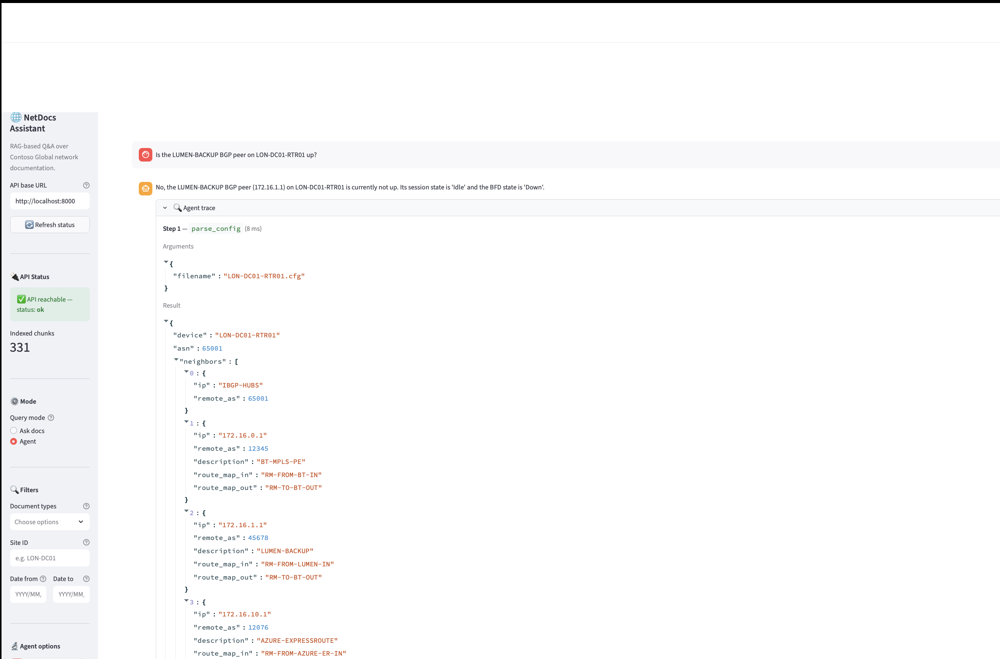
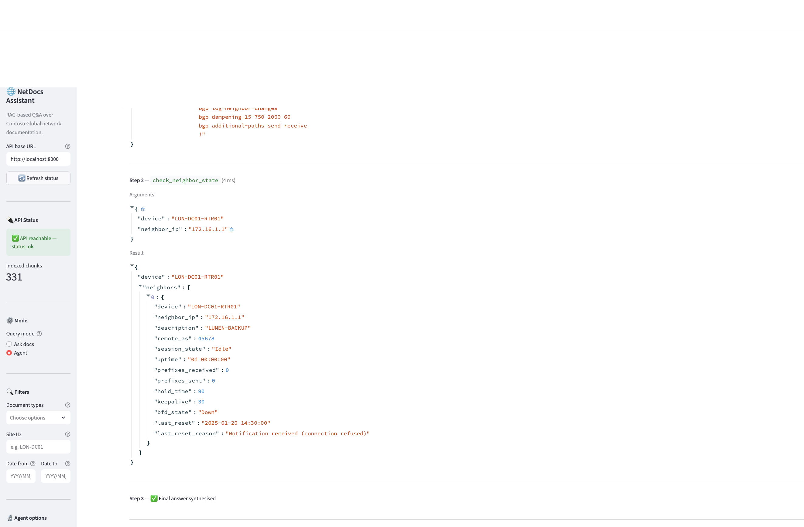
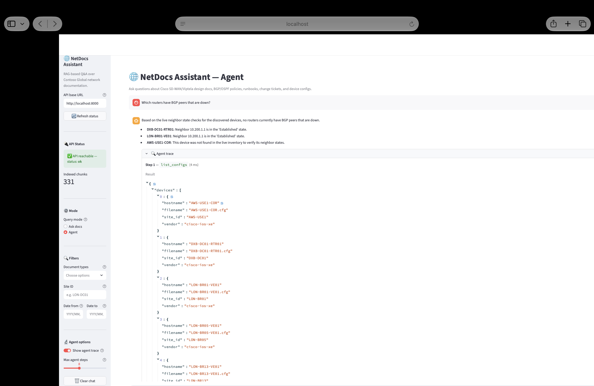
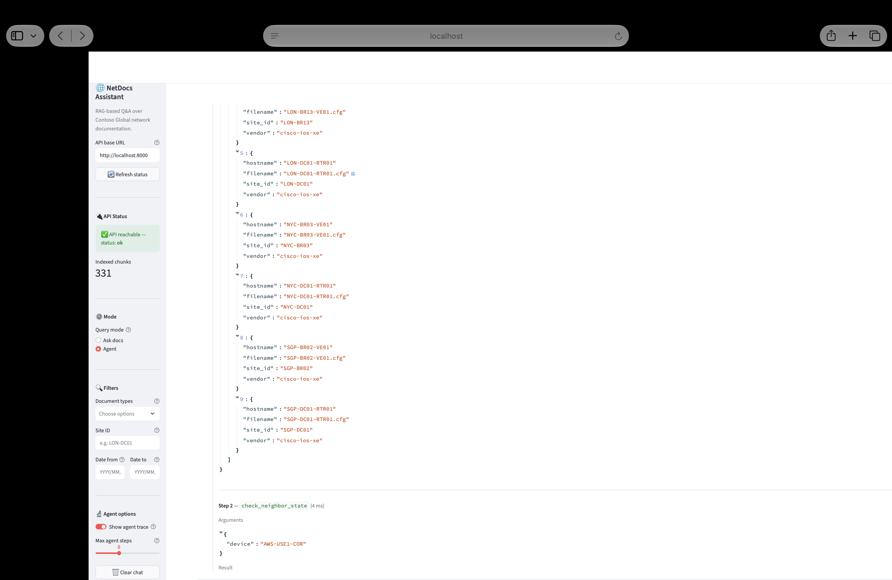
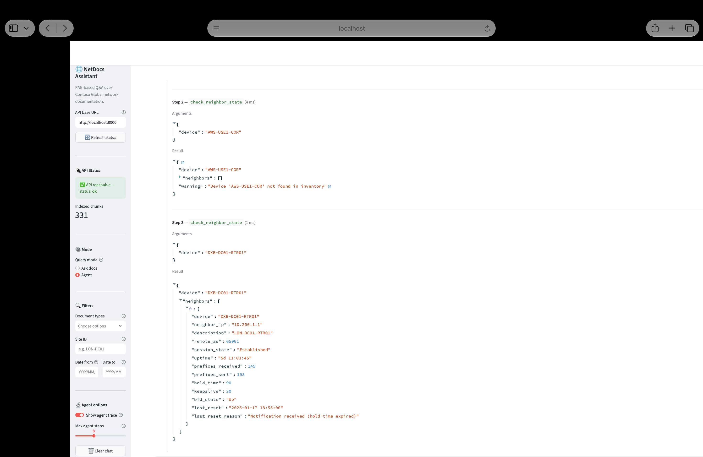
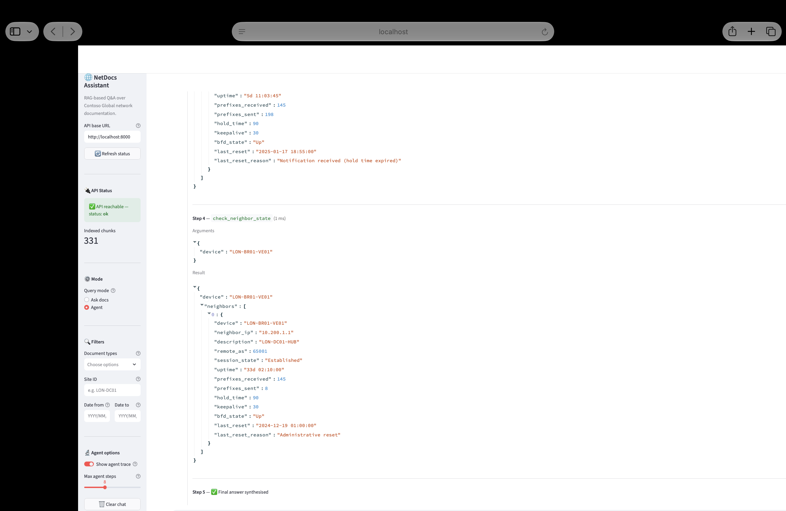

# NetDocs Assistant

A RAG assistant and tool-using agent over synthetic enterprise network documentation for a fictional company, **Contoso Global**. All data is synthetic — no real credentials, no real infrastructure. Built as a portfolio project demonstrating retrieval engineering, agent design, resilience patterns, and honest evaluation practice.

---

## 1. What it does and why

Network engineers and NOC analysts spend disproportionate time hunting through design docs, runbooks, change tickets, and device configs to answer questions like "What is the BGP runbook for a session flap?" or "Is the LUMEN-BACKUP peer on LON-DC01-RTR01 currently up?" This project builds an assistant that can answer both kinds of question: single-shot RAG over document text, and a multi-step agent that calls structured tools (parse config, check live neighbor state, find related tickets, draft a change plan) when the question requires it. The goal is to show how these components fit together in a production-minded way, with calibrated refusals, explicit fallback chains, and honest evaluation.

---

## 2. Architecture

```
  data/raw/  (configs, design docs, runbooks, tickets)
      │
      ▼
┌─────────────────────────────────────────┐
│  Ingestion Pipeline                     │
│  parse → chunk (per doc type) → embed  │
│  BAAI/bge-base-en-v1.5 embeddings       │
└────────────────┬────────────────────────┘
                 │ chunks + metadata
                 ▼
┌─────────────────────────────────────────┐
│  ChromaDB vector store + BM25 index     │
└────────────────┬────────────────────────┘
                 │
                 ▼
┌─────────────────────────────────────────┐
│  Hybrid Retrieval                       │
│  1. Dense ANN + BM25 → RRF fusion       │
│  2. Cross-encoder reranking (top-20→5)  │
│  3. Confidence threshold + OOD guard    │
└────────────────┬────────────────────────┘
                 │
        ┌────────┴────────┐
        ▼                 ▼
┌──────────────┐   ┌─────────────────────────────────────┐
│  RAG path    │   │  Agent loop (tool-calling)           │
│  (POST /ask) │   │  (POST /agent)                       │
│              │   │  list_configs → parse_config →       │
│  cited answer│   │  check_neighbor_state →              │
│              │   │  find_related_tickets →              │
└──────┬───────┘   │  draft_change_plan (approval gate)  │
       │           └──────────────┬──────────────────────┘
       └──────────────┬───────────┘
                      ▼
             ┌─────────────────┐
             │  LLM layer      │
             │  Gemini primary │
             │  fallback chain │
             │  extractive mode│
             └────────┬────────┘
                      │
         ┌────────────┴────────────┐
         ▼                         ▼
  FastAPI REST API          Streamlit UI
  POST /ask, /agent         agent-trace view
  GET  /health
```

### Chunking strategy

Chunking is structure-aware and specific to each document type, not a fixed-size sliding window:

- **Configs** (`configs/`) — parsed line-by-line against real IOS-XE and vEdge/Viptela syntax (`interface`, `router bgp/ospf/isis/rip/eigrp`, `route-map`, `ip prefix-list/community-list/access-list/vrf`, `policy-map`, `class-map`, `vrf definition`, `crypto ikev2/ipsec/keyring/pki`, `vpn <n>`, `system`, `omp`, `sdwan`, `bfd`, `ntp`, `aaa`). Each top-level block (an interface, a routing process, a VRF, ...) becomes exactly one chunk and is never split internally. Global commands outside any block (hostname, logging, ...) are collected into a preamble chunk, and near-empty or comment-only blocks are dropped. Metadata carries `device_name`, `block_type`, `block_name`, `block_index`, and a `site_id` inferred from hyphenated device naming (e.g. `LON-DC01-RTR01` → `LON-DC01`).
- **Runbooks** (`runbooks/`) — each H2/H3 procedure step becomes its own chunk. A section that exceeds the chunk-size budget is split at paragraph boundaries, never inside a fenced code block, so a multi-line CLI snippet always stays intact in one chunk. The first chunk of every runbook has a compact step table-of-contents appended, so if that chunk is the one retrieval surfaces, the LLM still sees the full procedure sequence and can cite the correct step. Metadata carries `runbook_id`, `procedure_name`, `step_number`, and a `device_role` inferred from the title (bgp → hub_router, ospf → dc_router, omp/tunnel/vedge/ztp → vedge, vmanage/cert → vmanage).
- **Design docs and tickets** — parsed as prose and chunked on heading/paragraph boundaries.

Every chunk is prefixed with `[DOC_TYPE: <type>] [SOURCE: <title>]` before embedding, so the retriever and reranker always know which document family and source a chunk came from.

### Component table

| Component | Technology | Notes |
|---|---|---|
| Embeddings | `BAAI/bge-base-en-v1.5` via sentence-transformers | Runs on CPU; no API key required for ingestion |
| Vector store | ChromaDB (persistent, local) | Cosine distance; 768-dim vectors |
| Keyword search | rank-bm25 | In-memory index rebuilt at startup |
| Hybrid fusion | Reciprocal Rank Fusion (RRF, k=60) | Merges dense + sparse top-50 lists |
| Reranking | cross-encoder `ms-marco-MiniLM-L-6-v2` | Re-scores top-20 candidates; ~50 ms on CPU |
| Refusal | Confidence threshold (0.25) + OOD regex guard | Refuses below-threshold and out-of-scope questions |
| LLM | Google Gemini via `google-generativeai` | Fallback chain handles 429/404/400; degrades to extractive |
| Agent | Plain Python `while` loop (`loop.py`) | No LangGraph/LangChain; max-steps guard; duplicate-call dedupe |
| API | FastAPI + Pydantic v2 | `POST /ask`, `POST /agent`, `GET /health` |
| UI | Streamlit | Agent-trace expandable view; degraded-mode banner |

---

## 3. Demo screenshots

### Single-device BGP check (two-step trace)

The agent answers "Is the LUMEN-BACKUP BGP peer on LON-DC01-RTR01 up?" by first parsing the router config to discover the peer, then checking the mock neighbor inventory.

**Step 1 — parse_config extracts BGP peers from the router config**



**Step 2 — check_neighbor_state looks up the peer in the mock inventory, then the agent answers**



---

### Network-wide BGP peer audit (four-step trace)

The agent answers "Which routers have BGP peers that are down?" by first listing all available configs, then checking neighbor state on each discovered device across the corpus.

**Part 1 — list_configs enumerates all device config files**



**Part 2 — check_neighbor_state on the first batch of devices**



**Part 3 — check_neighbor_state continues across remaining devices**



**Part 4 — agent synthesises the complete list of down peers and answers**



---

## 4. Quickstart

**Requirements:** Python 3.9+ (3.11 or 3.12 recommended — see Limitations), a free Gemini API key.

```bash
# 1. Clone and create a virtual environment
git clone <repo-url>
cd netdocs-assistant
python -m venv .venv && source .venv/bin/activate

# 2. Install dependencies
pip install -e ".[dev]"

# 3. Configure secrets — copy the example and add your key
cp .env.example .env
# Edit .env and set:  GEMINI_API_KEY=<your-key>
# Leave NETDOCS_LLM_PROVIDER=openai; the system auto-falls back to Gemini
# when openai is not keyed.

# 4. Ingest the synthetic corpus
make ingest

# 5. Start the API (terminal 1)
make api
# → http://localhost:8000  (Swagger: /docs)

# 6. Start the Streamlit UI (terminal 2)
make ui
# → http://localhost:8501
```

**Environment variables (key ones)**

| Variable | Default | Description |
|---|---|---|
| `GEMINI_API_KEY` | — | Required for LLM answer generation (free tier) |
| `GEMINI_MODEL` | `gemini-3.6-flash` | Primary Gemini model |
| `GEMINI_MODEL_FALLBACKS` | `gemini-3.6-flash,gemini-3-flash` | Comma-separated fallback chain |
| `NETDOCS_LLM_PROVIDER` | `openai` | Auto-falls back to `gemini` or `extractive` |
| `NETDOCS_RETRIEVAL_CONFIDENCE_THRESHOLD` | `0.10` | Min reranker score to answer (eval tuned to `0.25`) |
| `NETDOCS_API_URL` | `http://localhost:8000` | UI → API base URL |

Never put a real API key in the source tree. The `.gitignore` excludes `.env`.

---

## 5. Evaluation results and honest limitations

### Retrieval metrics (measured on 30-question golden set)

| Metric | Value |
|---|---|
| Questions evaluated | 30 (25 answerable + 5 unanswerable) |
| Hit@1 | 76.0% |
| Hit@3 | 80.0% |
| Hit@5 | 84.0% |
| MRR | 0.7813 |
| Refusal accuracy | 100.0% |

These numbers were measured after iterative tuning — chunk prefixing, doc-type reranker bonuses, query expansion, synonym normalisation, and confidence threshold calibration — all against this same golden set. They should be treated as upper-bound estimates on unseen questions.

**Honest limitations:**

- **Small golden set, tuned on it.** 30 questions is not enough to claim generalisation. The golden set was written by the same person who built the system and was used directly for tuning. An independent evaluation with a larger, held-out set would give more reliable numbers.
- **Synthetic data only.** All documents, configs, and tickets represent a fictional company. Behaviour on real enterprise documentation may differ significantly.
- **Four misses on answerable questions.** Q19, Q21, Q22 involve specific change ticket retrieval where the wrong document type is ranked first. Q24 asks for BGP config from LON-DC01-RTR01 but the reranker favours policy design docs over the config file. These are known gaps.
- **Python 3.9 EOL.** The project targets Python 3.9+ but Python 3.9 reached end-of-life in October 2025. Running on 3.9 produces deprecation warnings from some transitive dependencies. Python 3.11 or 3.12 is recommended.
- **Free-tier LLM quotas.** The Gemini free tier imposes daily request limits. The fallback chain handles this gracefully but once all models are exhausted, the system degrades to extractive mode (no LLM generation, returns retrieved passages directly).
- **Mock inventory gaps.** The `check_neighbor_state` tool reads from a mock inventory JSON. Devices such as `AWS-USE1-COR` have no entry in the inventory; the agent reports that it cannot verify their neighbor state rather than hallucinating.

### Test suite

180 tests pass (`pytest -q`), covering retrieval correctness, gemini fallback chain logic, refusal behaviour, agent tool dispatch, and API endpoint smoke tests.

---

## 6. Engineering decisions and lessons

**Refusal calibration.** A naive confidence threshold of `0.10` on raw cross-encoder logits refused too little — unanswerable questions like "What is the WiFi password?" scored above threshold because the reranker found partially relevant text. Raising the threshold to `0.25` eliminated false answers but risked over-refusing. An OOD regex guard (`is_out_of_scope()`) was added to catch topically absent subjects (SNMP community strings, ACI fabric, vendor SLA contracts) regardless of score. This combination achieves 100% refusal accuracy on the golden set.

**Fallback chain for real free-tier failures.** Running this project on the Gemini free tier surfaced three distinct failure modes: daily-quota `429` errors, retired-model `404` errors (models removed without notice for new users), and `INVALID_ARGUMENT 400` errors caused by unsupported `thinking_config` fields on some model versions. The `GEMINI_MODEL_FALLBACKS` chain handles all three: the client tries each model in order, remembers failed models for the process lifetime, and finally degrades to extractive mode rather than returning a 500. These were not hypothetical failure modes — they are what actually happened during development.

**Degraded extractive mode.** When all LLM models fail, the system returns the top retrieved passage directly as the answer with a `[DEGRADED]` prefix. This preserves some utility and is clearly flagged in the API response and the UI banner.

**Agent tool guardrails.** The agent loop has four explicit guards: a max-steps ceiling (default 8) to prevent runaway LLM iteration, duplicate-call detection that breaks the loop when the same `(tool, args)` pair repeats, per-tool timeouts via `concurrent.futures`, and a human-approval gate for `draft_change_plan` (the only state-mutating tool). The loop uses plain Python — no LangGraph, no LangChain — so the control flow is readable and debuggable without a framework-specific mental model.

**No framework for the agent.** The architecture doc specified LangGraph. In practice, a plain `while` loop with a structured JSON decision prompt turned out to be simpler to debug, easier to test, and sufficient for the tool set in scope. The lesson: evaluate framework complexity against actual requirements before committing.

**Retrieval improvements that worked.** Prefixing chunk text with `[DOC_TYPE: <type>] [SOURCE: <title>]` before embedding meaningfully improved recall for doc-type-specific queries. Query expansion for procedure phrases (appending "runbook procedure steps diagnosis recovery" when the query contains "how do I", "fix", "flaps") improved runbook retrieval. Synonym normalisation for network jargon ("neighbour"/"neighbor", "flapping"/"went down") improved BM25 recall.

---

## 7. Security and responsible use

- **Synthetic data only.** No real network credentials, no real device configs, no real company data appears anywhere in this repository.
- **API keys in gitignored `.env`.** The `.gitignore` excludes `.env`. The `.env.example` contains only placeholder values. Never commit a real key.
- **AI-generated answers must be verified.** Answers are produced by an LLM over retrieved context chunks. They can be incomplete, incorrectly cited, or wrong. Do not act on answers — especially change plans — without verifying against authoritative source documents.
- **Human approval for change plans.** The `draft_change_plan` tool carries `requires_approval=True`. In API mode, callers control whether the approval gate is enforced. In any real use, it should be.
- **No PII in the corpus.** All names, IP addresses, ticket IDs, and site identifiers in `data/raw/` are fictional.

---

## 8. How I used IBM Bob

IBM Bob's Agent mode was the primary development environment throughout this project. The workflow was: one focused task per prompt, review the diff, run tests and eval manually, then start the next task. Bob did not have persistent context across sessions — each task was self-contained.

**What Bob built in focused tasks:**

- The ingestion pipeline: file discovery, per-doc-type parsers, chunking strategy, metadata assembly, ChromaDB upsert with idempotent IDs.
- The hybrid retrieval layer: BM25 index, RRF fusion, cross-encoder reranker, confidence threshold and OOD guard.
- The evaluation harness: golden Q&A JSON, per-question hit/miss scoring, MRR calculation, report generation.
- The agent layer: tool implementations (`list_configs`, `parse_config`, `check_neighbor_state`, `draft_change_plan`, `find_related_tickets`), the explicit tool-calling loop with all guardrails, structured JSON logging, the decision and synthesis prompts.
- The Streamlit UI: chat panel, agent-trace expandable view, degraded-mode banner, sidebar filters, API status indicator.
- Resilience fixes: the `GEMINI_MODEL_FALLBACKS` chain, per-error-code handling (429/404/400), extractive fallback mode, the `refusal_reason` field on responses, and the banner model-name fix.

**What I did myself:**

- Reviewed every diff before accepting it.
- Ran `pytest` and `make eval` after each task and fed failures back as new prompts.
- Wrote the golden evaluation set questions.
- Tuned the confidence threshold and OOD guard patterns by inspecting per-question scores.
- Ran the actual system against the Gemini free tier and discovered the real failure modes (quota exhaustion, retired model 404, `thinking_config` rejection) that motivated the fallback chain.

**Issues found by running the real system (not caught by tests alone):**

- The primary Gemini model returned 404 for new API keys because the model had been retired for new users. The fallback chain was added after this happened.
- A `thinking_config` field in the generation request caused 400 `INVALID_ARGUMENT` errors on models that do not support thinking. The client was updated to handle this as a fallback trigger.
- The Gemini free tier daily quota was hit during a full eval run. This motivated remembering failed models at process level rather than retrying them on every request.
- The UI was showing the static `settings.llm_model` value ("gpt-4o-mini") even when the system had auto-switched to Gemini. The banner was fixed to resolve the actual active model name.

---

## 9. Roadmap

1. **Neighbouring-chunk context.** When a retrieved chunk is from the middle of a config block or runbook procedure, fetch the preceding and following chunks to give the LLM fuller context.
2. **Docker and CI.** A `Dockerfile` for the API and a GitHub Actions workflow running `pytest` and `make eval` (retrieval metrics only, no LLM calls) on every push to `main`.

---

*Answers produced by this tool are AI-generated and must be verified against authoritative source documents before acting on them. All data in this repository is synthetic.*
